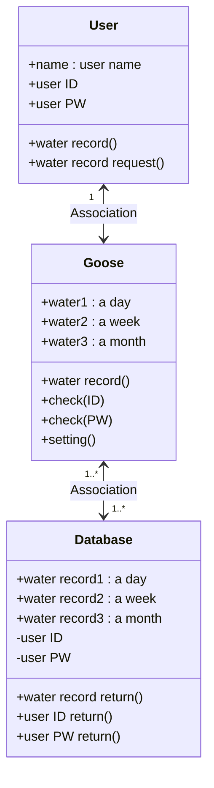

```mermaid
classDiagram
    
    class User{
        +name : user name
        +user ID
        +user PW

        +water record()
        +water record request()
    }

    class Goose{
        +water1 : a day
        +water2 : a week
        +water3 : a month 

        +water record()
        +check(ID)
        +check(PW)
        +setting()
    }

    class Database{
        +water record1 : a day
        +water record2 : a week
        +water record3 : a month 
        -user ID
        -user PW

        +water record return()
        +user ID return()
        +user PW return()
    }

    User "1"<--> Goose : Association
    Goose "1..*"<-->"1..*" Database : Association
```
