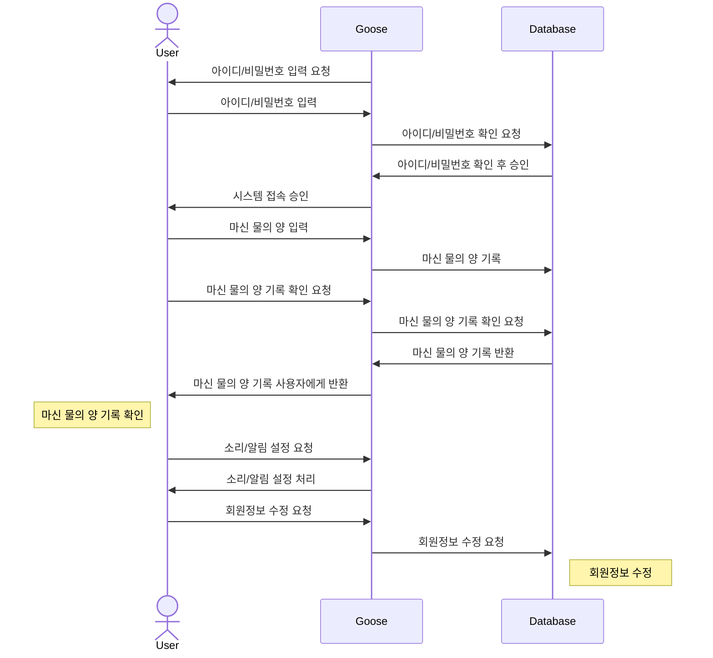

```mermaid
sequenceDiagram
    actor A as User
    participant B as Goose
    participant C as Database

    B ->> A : 아이디/비밀번호 입력 요청
    A ->> B : 아이디/비밀번호 입력
    B ->> C : 아이디/비밀번호 확인 요청
    C ->> B : 아이디/비밀번호 확인 후 승인
    B ->> A : 시스템 접속 승인
    A ->> B : 마신 물의 양 입력
    B ->> C : 마신 물의 양 기록
    A ->> B : 마신 물의 양 기록 확인 요청
    B ->> C : 마신 물의 양 기록 확인 요청
    C ->> B : 마신 물의 양 기록 반환
    B ->> A : 마신 물의 양 기록 사용자에게 반환
    Note left of A : 마신 물의 양 기록 확인
    A ->> B : 소리/알림 설정 요청
    B ->> A : 소리/알림 설정 처리
    A ->> B : 회원정보 수정 요청
    B ->> C : 회원정보 수정 요청
    Note right of C : 회원정보 수정
```