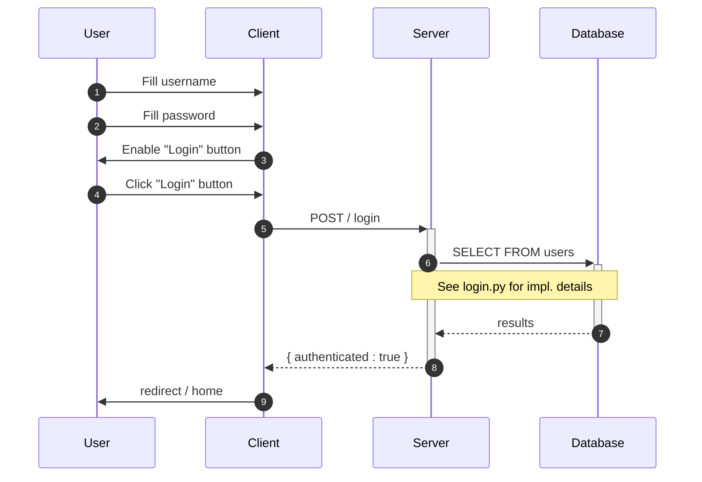
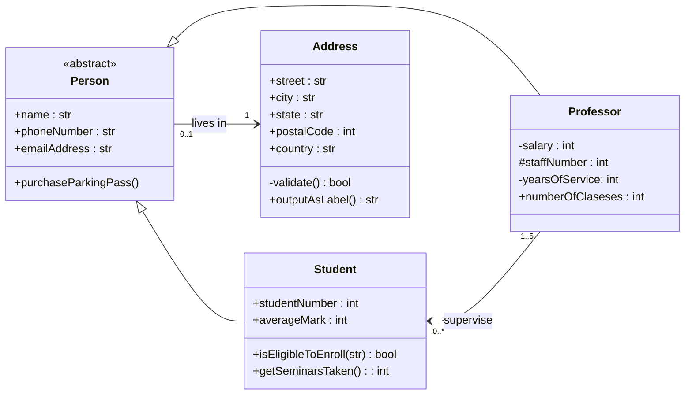

# Mermaid 실습

```mermaid
sequenceDiagram
    autonumber
    participant U as User
    participant C as Client
    participant S as Server
    participant DB as Database
    
    U ->> C : Fill username
    U ->> C : Fill password
    C ->> U : Enable "Login" button
    U ->> C : Click "Login" button

    C ->>+ S : POST / login
        S ->>+ DB : SELECT FROM users
        Note over S,DB : See login.py for impl. details
        DB -->>- S : results
    S -->>- C : { authenticated : true }

    C ->> U : redirect / home

```

```mermaid
classDiagram
    direction LR

    class Person{
        <<abstract>>
        +name : str
        +phoneNumber : str
        +emailAddress : str
        +purchaseParkingPass()
    }

    class Student{
        +studentNumber : int
        +averageMark : int
        +isEligibleToEnroll(str) bool
        +getSeminarsTaken() : int
    }

    class Professor{
        -salary : int
        #staffNumber : int
        -yearsOfService: int
        +numberOfClaseses : int
    }

    class Address{
        +street : str
        +city : str
        +state : str
        +postalCode : int
        +country : str
        -validate() bool
        +outputAsLabel() str
    }

    Person <|-- Student
    Person <|-- Professor
    Student "0..*" <--"1..5" Professor : supervise
    Person "0..1" --> "1" Address : lives in

```
